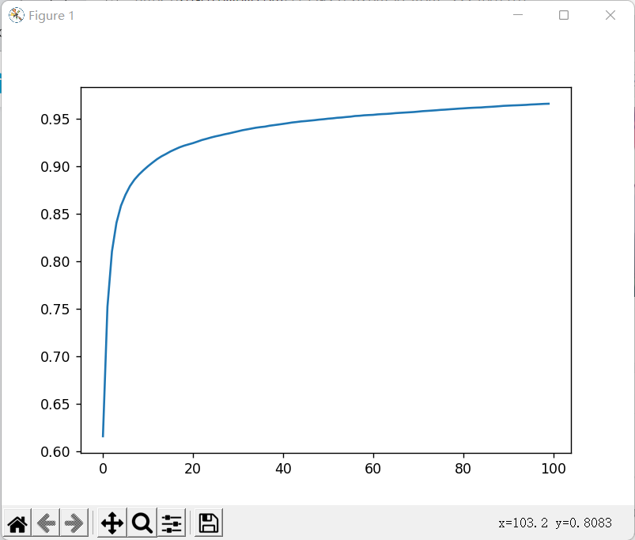

# Handwriting recognition
This is a handwriting digit recognition project.

As I am studying network with python, I would just use numpy and matplotlib to build the network.

The training data is MNIST, and maybe something else.

## About the files
### deep-learning.py
This file contains the main function.
### network.py
This file contains the class Network, which is a 3 layer network.

The hide layer is set to 64 and 16, which was found good reaction to Mnist.
### mnist.py
This file contains the class Mnist, which is used to load the data. 
### functions.py
Some simple functions, like sigmoid and softmax. 
### test_correct_rate_0.*rate*.net
A trained network with correct rate: *rate* in 100 epoch, this is the training log:

Load it by *load(rate)* in *deep-learning.py*
